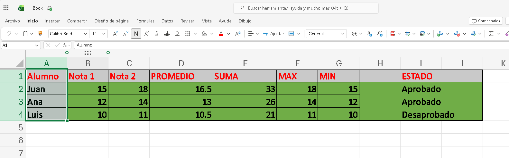

# Proyecto 01: Calculadora de Notas en Excel

## 📌 Descripción
Tabla en Excel para registrar notas de alumnos y calcular automáticamente el promedio, suma, nota máxima, mínima y estado de aprobado/desaprobado.

Este es el Proyecto 1 de mi ruta "Excel de Básico a Avanzado".

## 🎯 Objetivo
Aprender fórmulas básicas de Excel y aplicarlas para automatizar el cálculo de notas escolares.

## 🛠️ Habilidades Aplicadas
- **Fórmulas Básicas:** ´PROMEDIO´, SUMA, MAX, MIN
- **Fórmulas Lógicas:** ´SI´para determinar estado
- **Formato:** Colores, bordes y negrita para mejor visualización
- **Referencias de celdas:** Uso de rangos `B2:C2`

## 📊 Fórmulas Utilizadas

Promedio: =PROMEDIO(B2:C2)

Suma:     =SUMA(B2:C2)

Máxima:   =MAX(B2:C2)

Mínima:   =MIN(B2:C2)

Estado:   =SI(D2>=13,"Aprobado","Desaprobado")

### 📸 EVIDENCIA - Resultado Final

