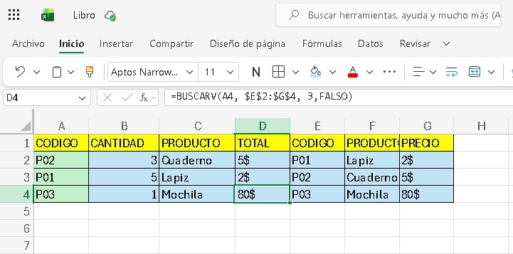

## 📌 LAB 03: FUNCIÓN `BUSCARV` - SISTEMA DE VENTAS

### 1. OBJETIVO
Usar la función `BUSCARV` para buscar datos en una tabla y calcular totales automáticamente.

### 2. MARCO TEÓRICO
`BUSCARV` busca un valor en la primera columna de una tabla y devuelve un valor de la misma fila desde otra columna.

**Sintaxis:**
``excel
=BUSCARV(valor_buscado, rango_tabla, num_columna, [coincidencia_exacta])

